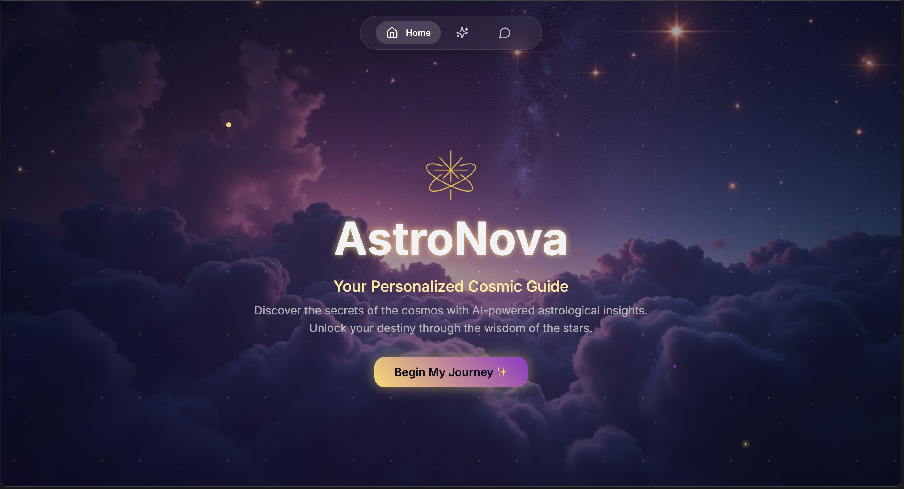

# 🌟 AstroNova - AI Astrologer

**Your Personalized Cosmic Guide** ✨

AstroNova is an AI-powered astrology application that provides personalized cosmic insights, horoscope readings, and interactive astrological consultations. Built with React and powered by n8n AI workflows, it combines modern web technology with mystical astrological wisdom.

## ✨ Features

- **Birth Details Collection**: Elegant form to capture name, date, time, and place of birth
- **AI-Powered Astrology**: Integration with n8n workflow for intelligent astrological readings
- **Interactive Chat Interface**: Real-time conversation with your personal cosmic guide
- **Personalized Readings**: Tailored predictions based on your birth chart
- **Responsive Design**: Seamless experience across desktop and mobile devices
- **Session Management**: Persistent chat sessions with birth detail integration

## 🎯 Live Demo

Experience the cosmic magic at: `http://localhost:8080` (after setup)

## 🛠️ Installation & Setup

### Prerequisites
- **Node.js** (v16 or higher)
- **npm** or yarn package manager
- **n8n** (for AI backend workflow)

### Part 1: Frontend Setup

1. **Clone the repository**
   ```bash
   git clone https://github.com/anishks07/AstroNova.git
   cd AstroNova
   ```

2. **Install dependencies**
   ```bash
   npm install
   ```

3. **Configure environment variables**
   ```bash
   # Copy the example environment file
   cp .env.example .env
   
   # Edit .env with your settings
   # VITE_AI_BACKEND_URL=http://localhost:5678/webhook/ai-astrologer
   ```

4. **Start development server**
   ```bash
   npm run dev
   ```
   
   The application will be available at `http://localhost:8081`

### Part 2: AI Backend Setup (n8n)

The AI astrologer functionality is powered by an n8n workflow that connects to multiple AI services.

#### Option A: Using n8n Cloud
1. Sign up at [n8n.cloud](https://n8n.cloud)
2. Import the workflow from `astronova.json`
3. Configure the webhook URL in your `.env` file
4. Set up required API credentials (see below)

#### Option B: Self-hosted n8n
1. **Install n8n**
   ```bash
   npm install n8n -g
   ```

2. **Start n8n**
   ```bash
   n8n start
   ```
   
   n8n will be available at `http://localhost:5678`

3. **Import the AI Astrologer workflow**
   - Open n8n dashboard at `http://localhost:5678`
   - Go to "Workflows" → "Import from File"
   - Select `astronova.json` from the project root
   - Click "Import Workflow"

4. **Configure API credentials**
   
   The workflow uses multiple AI services. Set up credentials in n8n:
   
   - **Groq API**: Get API key from [Groq Console](https://console.groq.com)
   - **Gemini API**: Get API key from [Google AI Studio](https://makersuite.google.com)
   - **Brave Search**: Get API key from [Brave Search API](https://api.search.brave.com)
   - **HuggingFace**: Get API key from [HuggingFace](https://huggingface.co/settings/tokens)
   - **Firecrawl** (optional): Get API key from [Firecrawl](https://firecrawl.dev)

5. **Update webhook URL**
   - In the workflow, click on the "Webhook" node
   - Note the webhook URL (e.g., `http://localhost:5678/webhook/ai-astrologer`)
   - Update your `.env` file with this URL:
     ```
     VITE_AI_BACKEND_URL=http://localhost:5678/webhook/ai-astrologer
     ```

6. **Activate the workflow**
   - Click "Active" toggle to enable the workflow
   - Test the webhook by clicking "Execute Workflow"

### Part 3: Final Setup

1. **Restart the frontend** (if it was running)
   ```bash
   # Stop the dev server (Ctrl+C) and restart
   npm run dev
   ```

2. **Test the connection**
   - Visit `http://localhost:8081`
   - Fill in birth details and navigate to chat
   - Send a test message to verify AI responses

## 🏗️ Tech Stack

### Frontend
- **[React 18](https://react.dev/)** - Modern React with hooks and concurrent features
- **[TypeScript](https://www.typescriptlang.org/)** - Type-safe JavaScript development
- **[Vite](https://vitejs.dev/)** - Fast build tool and development server
- **[Tailwind CSS](https://tailwindcss.com/)** - Utility-first CSS framework
- **[React Router](https://reactrouter.com/)** - Client-side routing
- **[Radix UI](https://www.radix-ui.com/)** - Accessible UI primitives

### Backend AI Workflow
- **[n8n](https://n8n.io/)** - Workflow automation platform
- **[Groq](https://groq.com/)** - Fast LLM inference
- **[Google Gemini](https://ai.google.dev/)** - Advanced AI responses
- **[Brave Search](https://search.brave.com/)** - Real-time web data
- **[HuggingFace](https://huggingface.co/)** - NLP models
- **[Firecrawl](https://firecrawl.dev/)** - Web scraping for context

## 📱 Project Structure

```
AstroNova/
├── src/
│   ├── components/ui/           # UI Components
│   │   ├── cosmic-chat.tsx      # AI chat interface
│   │   ├── birth-details-form.tsx # Birth details form
│   │   ├── hero-section.tsx     # Landing page hero
│   │   └── ...                  # Other UI components
│   ├── pages/
│   │   ├── Index.tsx            # Home page
│   │   ├── Chat.tsx             # Chat page
│   │   └── NotFound.tsx         # 404 page
│   └── ...
├── astronova.json               # n8n AI workflow
├── .env.example                 # Environment template
└── README.md                    # This file
```

## 🎨 Key Features

### 🌌 Mystical User Interface
- **Cosmic Background**: Animated starfield with glassmorphic overlays
- **Gold Accents**: Elegant color scheme with purple and gold gradients
- **Smooth Animations**: Typewriter effects, fade-ins, and hover transitions
- **Responsive Design**: Mobile-first approach with seamless scaling

### � AI-Powered Astrology
- **Multi-Source Intelligence**: Combines multiple AI models for comprehensive readings
- **Personalized Responses**: Uses birth details for targeted astrological insights
- **Real-time Chat**: Instant responses with conversation memory
- **Session Persistence**: Maintains context across page refreshes

### 📊 Birth Chart Integration
- **Complete Birth Data**: Name, date, time, and place of birth
- **Zodiac Recognition**: Automatic sign detection and personalization
- **Data Persistence**: Secure local storage of user preferences

## 🚀 Production Deployment

### Build for Production
```bash
npm run build
```

### Preview Production Build
```bash
npm run preview
```

### Environment Variables for Production
```bash
# For production deployment, update your .env:
VITE_AI_BACKEND_URL=https://your-n8n-instance.com/webhook/ai-astrologer
```

## 🔧 Troubleshooting

### Common Issues

1. **"Cosmic connection seems unstable" message**
   - Check if n8n is running (`http://localhost:5678`)
   - Verify the webhook URL in `.env` matches your n8n workflow
   - Ensure the workflow is active in n8n

2. **API errors in n8n workflow**
   - Verify all API credentials are configured correctly
   - Check API quotas and rate limits
   - Test individual nodes in the workflow

3. **Frontend not loading environment variables**
   - Restart the dev server after changing `.env`
   - Ensure variables start with `VITE_`
   - Check browser console for error messages

### Debug Mode
Enable debug logging by checking the browser console. The app logs:
- Environment variable loading
- API call attempts
- Response handling

## 🤝 Contributing

1. Fork the repository
2. Create your feature branch (`git checkout -b feature/cosmic-enhancement`)
3. Commit your changes (`git commit -m 'Add stellar feature'`)
4. Push to the branch (`git push origin feature/cosmic-enhancement`)
5. Open a Pull Request

## 📄 API Documentation

### Webhook Endpoint
The n8n workflow expects POST requests with this format:

```json
{
  "user_input": "What does my horoscope say today?",
  "session": "unique_session_id",
  "birth_details": {
    "name": "User Name",
    "date": "1990-01-01",
    "time": "12:00",
    "place": "New York, NY"
  }
}
```

### Response Format
```json
{
  "response": "Your personalized astrological insight...",
  "session": "unique_session_id"
}
```

## 📝 License

This project is open source and available under the [MIT License](LICENSE).

## 🙏 Acknowledgments

- **AI Services**: Powered by Groq, Gemini, Brave Search, and HuggingFace
- **UI Framework**: Built with React and Tailwind CSS
- **Workflow Engine**: Automated with n8n
- **Design Inspiration**: The cosmic beauty of the universe ✨

---

**Created by [Anish](https://github.com/anishks07) - May the stars guide your code!** 🌟

For questions or support, please open an issue on GitHub.
